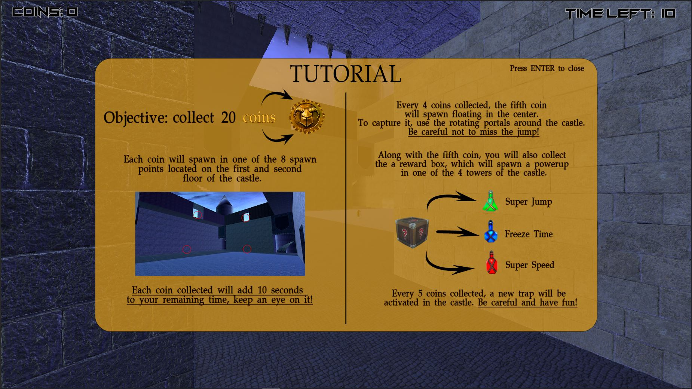

 

    
  <h3 align="center">Coin Runner</h3>
  

    CS50 Final Project - Matias Ezequiel Castelnuovo
  

  
Content

  <ol>
    <li>
      <a href="#project-overview">Project Overview</a>
    </li>
    <li><a href="#concept">Concept</a></li>
    <li><a href="#Mechanics">Mechanics</a></li>
    <li><a href="#usage">Usage</a></li>
    <li><a href="#states">States</a></li>
    <li><a href="#assets">Resources</a></li>
    <li><a href="#demostration">Demostration</a></li>
  </ol>

## Project Overview
Coin Runner is a first-person video game that seeks to integrate most of the mechanics learned throughout the course, resulting in a project with a simple but entertaining premise. The idea takes inspiration from games with a more accelerated mode such as Hotline Miami, Ruiner, Nex Machina and Refunct, combining fast gameplay with music and sounds that stimulate the player to move constantly and think about their movements. The project was developed with C#, Unity 2022.3.11 and Blender 4.0. I also used Adobe Photoshop, Adobe Premiere and BFXR for UI and Audio. 
 
## Concept

The game consists of collecting 20 coins that will appear periodically in one of the 8 predetermined locations on the map while a timer decreases as the game progresses, and can be increased with each recollection. Also, the map will generate traps in its environment every time the user collects 5 coins, adding more difficulty and challenge to the map. 
Every 4 coins collected, the fifth coin will appear floating in the center of the map, which can only be obtained by using the portals that rotate around the castle. Like the procedural modifications to the environment, this decision was made because, although the traps are an increase in difficulty, they are easy for most players to avoid.

The player wins when he manages to get all 20 coins. On the contrary, he loses if:
* Falls into the void (below the map limits)
* The player comes in contact with lava (animated)
* The player comes in contact with the lower part of the castle's fence when it is descending (animated)
* His time runs out

The player can obtain powerups that will give him a temporary advantage. These are:
* Freeze time 
* Power up movement speed
* Boost jump height

All this is explained at the beginning of the game, in a tutorial with an image format that the player must hide by pressing `ENTER`. This was defined with the objective of giving the player the control to decide when he/she is ready to start.
In addition, the tutorial appears every time the game starts, regardless if it is your first run or if you have just lost a previous game. This decision was made after testing it with several players and noticing that many of them needed to read it several times after losing to understand how certain mechanics worked.

  

## Mechanics

Among the integrated mechanics, the following stand out:
* Use of powerups
* Use of ProBuilder and ProGrids tools.
* Deaths by collision and fall. 
* Teleportation of the player from point A to point B
* Random generation of coins and powerups 
* Scenario modification according to events
* Animations on death
* Moving object generation 
* Integrated tutorial
* Integrated tutorial
* Transitions between scenes
* Physics
* Loading screen

Speaking of the technical section, I have integrated the unit / C # own algorithms such as:
* Coroutines
* Vectors
* Animator 
* Delegated functions

<a href="#readme-top">back to top</a>

## Usage

Inside the `BUILD PJ` folder, you can find the built project for Windows. Just run the `Coin Runner.exe` file.
 

## States

The video game presents 4 possible states, separated into scenes.

  

The first state consists of an main menu, in which the player can start a new game or exit the game.

  

The second state consists of the gameplay.

  

The third state consists of the victory screen, in which the user can return to the game or return to the main menu.

  

The fourth and last state is the defeat screen. As in the previous one, the user can play again or return to the main menu.

## Resources

The following assets were used during the development of this project.

* [Starter Assets: Character Controllers | URP](https://assetstore.unity.com/packages/essentials/starter-assets-character-controllers-urp-267961)
* [Potions, Coin And Box of Pandora Pack](https://assetstore.unity.com/packages/3d/props/potions-coin-and-box-of-pandora-pack-71778)
* [Weathered Brown Planks](https://polyhaven.com/a/weathered_brown_planks)
* [Medieval Blocks 03](https://polyhaven.com/a/medieval_blocks_03)
* [Roof 09](https://polyhaven.com/a/roof_09)

> Note: the castle yetts are taken from an asset that I could not find the link to again.

 

## Demostration
Here we have a small demo of the game working

<a href="#readme-top">back to top</a>

